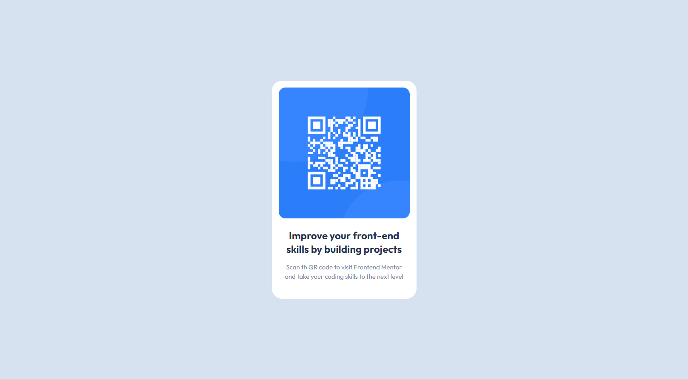

# QR Code Component Solution

This is a solution to the [QR code component challenge on Frontend Mentor](https://www.frontendmentor.io/challenges/qr-code-component-iux_sIO_H).

## Table of contents

- [Overview](#overview)
    - [Screenshot](#screenshot)
    - [Links](#links)
- [My process](#my-process)
    - [Built with](#built-with)
    - [Useful resources](#useful-resources)
- [Author](#author)

## Overview

### Screenshot

### Links

- Live Site URL: [Demo](https://your-live-site-url.com)

## My process

### Built with

- Semantic HTML5 markup
- CSS custom properties
- Flexbox
- CSS Grid
- Mobile-first workflow
- [VUE](https://vuejs.org/) - VUE framework
- [Styled Components](https://tailwindcss.ru/) - For styles

### Useful resources

- [Google Fonts](https://fonts.google.com/)

## Author

- Frontend Mentor - [@IlyaChichkov](https://www.frontendmentor.io/profile/IlyaChichkov)
